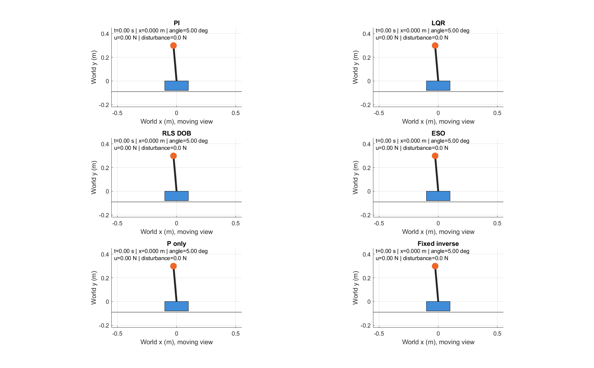
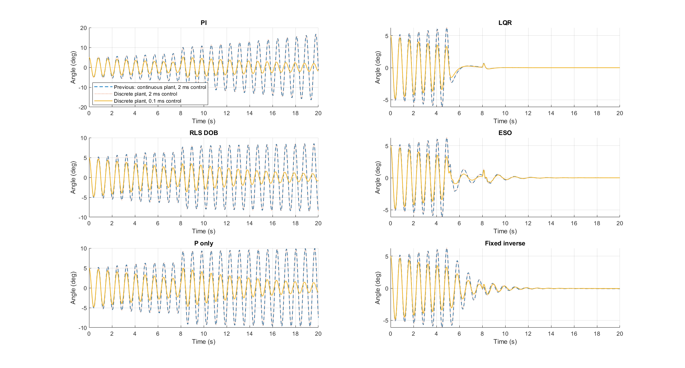
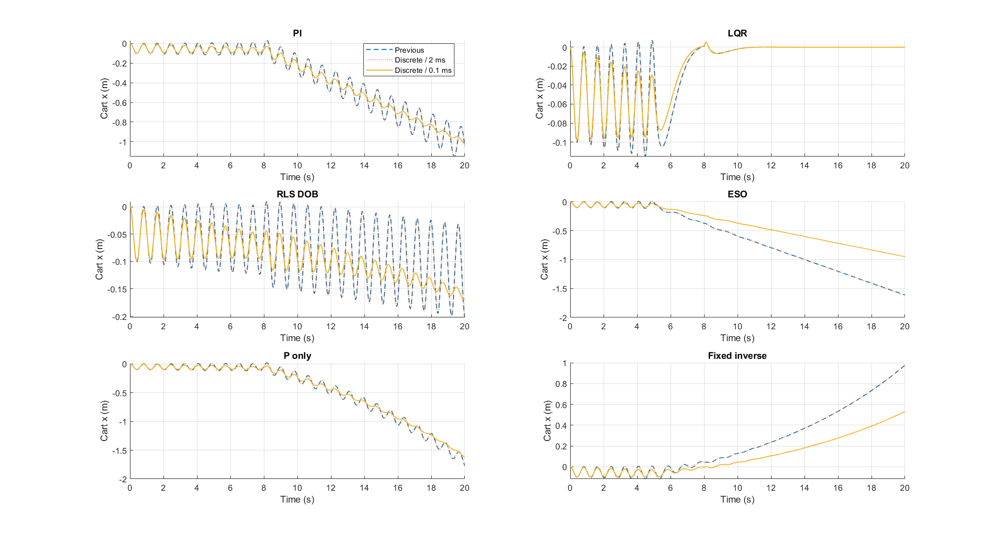
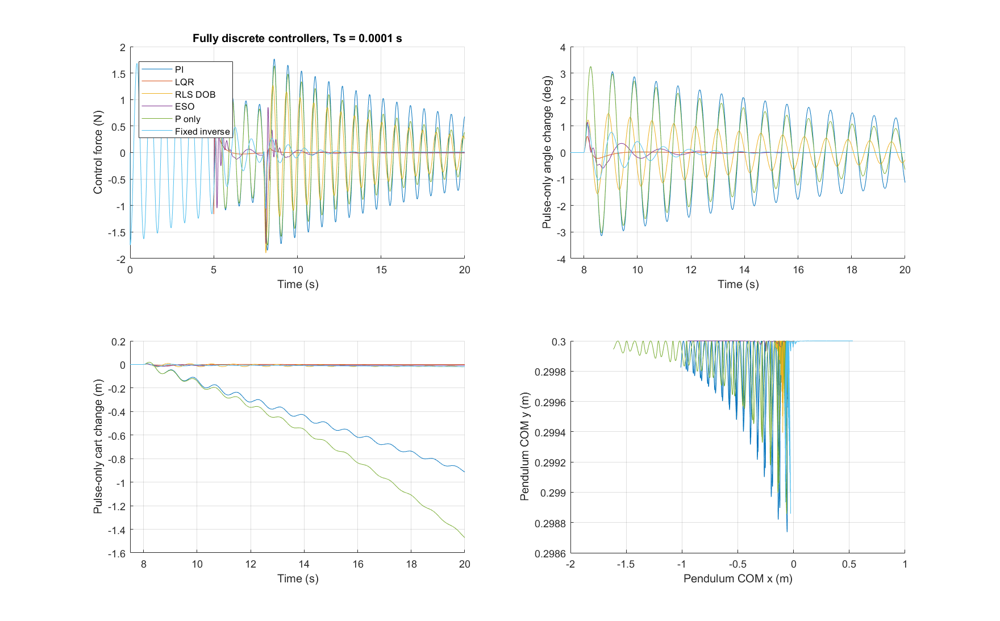

# Ayrık Zamanlı Araba-Sarkaç Kontrolü
## Sürekli modelden 0,1 ms örneklemeli karşılaştırmaya

**Ders notu ve uygulama rehberi | 3 Ekim 2026**

Bu çalışma, aynı araba-sarkaç sisteminin önceki denetleyicilerle nasıl davrandığını ve kontrol edilen sistemin modeli ile denetleyiciler ayrık zamana taşındığında nelerin değiştiğini inceler. Burada İngilizce “plant” terimi için **kontrol edilen sistem** ifadesi kullanılır. Modelin durum güncellemesi, denetleyicinin örnekleme süresi, gözleyici katsayıları ve ölçümden kuvvetin uygulanmasına kadar geçen süre birlikte ele alınır.

Ana karşılaştırma modeli, 0,0001 s sabit adımlı ayrık çözücü kullanır. Bu süre 0,1 ms, örnekleme frekansı ise 10 kHz demektir. Bu sayısal örnekleme hızıdır; kodun fiziksel bir işlemcide her 100 mikrosaniyede çalışabildiği ölçülmemiştir.

**Öğrenme hedefleri:** Durum değişkenlerinden mekanik denklemleri kurmak; sistemin ayrık zamanlı modeli ile ayrık çözücü arasındaki farkı açıklamak; önceki PI, LQR ve gözleyici tabanlı denetleyicileri anlamak; bozucu etkisini başlangıç hareketinden ayırmak; MATLAB x/y koordinatlarıyla animasyon üretmek; sonuçları yeniden çalıştırıp doğrulamak.



Araştırma yönlendirmesi: Volkan Aran. Kod, hesaplama, açıklamalar ve arşiv hazırlığı insan yönlendirmesi altında OpenAI Codex katkısıyla geliştirilmiştir. Bu not, kayıtlı simülasyonların öğretici açıklamasıdır.

---

## 1. Fiziksel sistem ve işaret seçimi

Araba yatay doğrultuda hareket eder. Sarkacın dönme noktası arabanın üzerindedir. Durum vektörü dört elemanlıdır:

```text
z = [x; v; theta; omega]
v = dx/dt,  omega = dtheta/dt
```

Burada x arabanın konumu, v hızı, theta dik yukarı konumdan ölçülen sarkaç açısı ve omega açısal hızdır. Denge hedefi z=0'dır. theta=0 dik yukarıyı gösterir; serbest bırakılmış bu denge kararsızdır. Pozitif theta, sarkacın kütle merkezini sola taşır. Bu seçim daha sonra hem dinamiklerin işaretlerini hem animasyonu belirler.

| Parametre | Değer | Açıklama |
|---|---|---|
| M | 0,5 kg | Araba kütlesi |
| m | 0,2 kg | Sarkaç kütlesi |
| b | 0,1 N s/m | Arabadaki viskoz sürtünme |
| l | 0,3 m | Dönme noktası ile sarkaç kütle merkezi arası |
| I | 0,006 kg m² | Sarkacın kütle merkezi etrafındaki atalet momenti |
| g | 9,8 m/s² | Yerçekimi ivmesi |

Denetleyici u kuvvetini üretir; dış bozucu d ayrıca eklenir. Kontrol edilen sisteme uygulanan toplam kuvvet F=u+d'dir. Denetleyici kuvveti -10 ile +10 N arasında sınırlandırılır. Bozucu bu sınırlandırmadan sonra eklendiğinden toplam kuvvet ±10 N aralığını aşabilir.

Kısaltmalar J=I+m*l²=0,024 kg m² ve h=m*l=0,06 kg m olarak tanımlansın. Hareket denklemleri şu iki bağlı denklemle yazılır:

```text
(M+m)*xddot - h*cos(theta)*thetaddot
    = F - b*v - h*sin(theta)*omega²
J*thetaddot - h*cos(theta)*xddot = h*g*sin(theta)
```

Kodda R=F-b*v-h*sin(theta)*omega², G=h*g*sin(theta) ve Delta=(M+m)*J-(h*cos(theta))² kullanılır. İvmeler:

```text
xddot     = (J*R + h*cos(theta)*G) / Delta
thetaddot = (h*cos(theta)*R + (M+m)*G) / Delta
```

Bu ifadeler `discrete_cart_plant.m` içindedir. Doğrulama kodu aynı ivmeleri bağımsız bir 2x2 kütle matrisi çözümüyle hesaplar; böylece aynı cebirsel ifadenin yalnızca tekrar edilmesiyle yetinilmez.

---

## 2. Ayrık zamanlı sistem modeli ve çözücü

Sürekli zamanlı modelde integratörler dz/dt=f(z,F) denkleminin çözümünü temsil eder. Simulink'in sürekli zaman çözücüsü, durum türevlerini ara zamanlarda da değerlendirir. Ayrık zamanlı modelde ise durumlar yalnızca belirli anlarda güncellenir:

```text
z[k+1] = Phi(z[k], F[k], Ts)
```

Kontrol edilen sistemin yeni modeli dört ayrık durum içerir; sürekli durumu yoktur. Simulink çözücüsü `FixedStepDiscrete`, sabit adımı 1e-4 s'dir. Modeldeki Phi durum geçişi, klasik dördüncü mertebe Runge-Kutta yöntemiyle hesaplanır. Adım boyunca kuvvet sabit kabul edilir; ara durumlarda türev hesapları yapılır:

```text
k1 = f(z[k], F[k])
k2 = f(z[k] + Ts*k1/2, F[k])
k3 = f(z[k] + Ts*k2/2, F[k])
k4 = f(z[k] + Ts*k3,   F[k])
z[k+1] = z[k] + Ts*(k1 + 2*k2 + 2*k3 + k4)/6
```

Buradaki RK4 hesabı, ayrık S-function bloğunun durum güncellemesi içinde yapılır. Simulink'te seçilen çözücü `FixedStepDiscrete` olarak kalır. Denetleyici RK4'ün ara durumlarında yeniden çağrılmaz; adım boyunca aynı kuvvet kullanılır.

`discrete_cart_plant` fonksiyonunda flag=0 boyutları, başlangıç durumunu ve örnekleme süresini tanımlar. flag=2 bir sonraki durumu hesaplar; flag=3 mevcut durumu çıkışa verir. Blok çıkışı yalnızca mevcut duruma bağlıdır; o andaki kuvvete doğrudan bağlı değildir. Simulink'te bu özellik, doğrudan geçişin bulunmaması (direct feedthrough=0) olarak tanımlanır.

Ara karşılaştırmada sistem modeli 0,1 ms, denetleyici 2 ms aralıklarla güncellenir: her denetleyici örnekleme periyodunda sistem modeli 20 adım ilerler. Son modelde her iki süre de 0,1 ms'dir. Bu ayrım, sistem modelinin ayrıklaştırılmasından kaynaklanan etkiyi denetleyici örnekleme süresinin etkisinden ayırmaya yardımcı olur.

**Kontrol edin:** `cart_pendulum_discrete.slx` modelini açın. Solver bölümünde `FixedStepDiscrete` ve `0.0001` değerlerini görün. `Plant_` önekli sistem bloklarında Ts, `Control_` önekli denetleyici bloklarında Tc kullanıldığını inceleyin. Bu İngilizce adlar, Simulink modelindeki blokları bulmayı kolaylaştırmak için korunmuştur.

---

## 3. Doğrusal model ve LQR bağlantısı

Dik yukarı dengeye yakınken sin(theta) yaklaşık theta, cos(theta) yaklaşık 1 alınabilir. İkinci dereceden küçük terimler bırakılır. q=(M+m)*J-h² tanımıyla sürekli doğrusal model:

```text
zdot = A*z + B*F
A = [0,       1,             0,       0;
     0, -J*b/q,       h²*g/q,       0;
     0,       0,             0,       1;
     0, -h*b/q, (M+m)*h*g/q,       0]
B = [0; J/q; 0; h/q]
```

Sabit tutulan giriş için doğrusal ayrık model matris üstelinden elde edilir:

```text
expm([A B; zeros(1,5)]*Ts) = [Az Bz; 0 1]
z[k+1] = Az*z[k] + Bz*F[k]
```

Bu işlem doğrusal modelin sıfırıncı dereceden tutucu altında tam ayrıklaştırmasıdır. Doğrusal olmayan model için kullanılan RK4 ise sayısal bir yaklaşımdır. `cart_pendulum_discrete_plants.slx` iki modeli aynı kuvvet altında yan yana içerir. Büyük açı hareketlerinde doğrusal modelden fiziksel doğruluk beklenmemelidir.

Önceki doğrusal karesel regülatör (LQR) tasarımında Q=diag(10,1,100,1), R=0,1 kullanılır. Sürekli zaman maliyet fonksiyonu, durum sapmaları ile kontrol kuvvetinin ağırlıklı karelerinin zaman integralidir. Riccati çözümü P ile K=R^(-1)*B'*P hesaplanır. Kod, Control System Toolbox gerektirmemek için Hamiltonyen matrisin kararlı özuzayını kullanır ve Riccati denkleminin sayısal artık hatasını denetler.

Uygulanan komut u_raw=-K*z, çıkış ise sat(u_raw)'dır. Bu çalışmada K yeniden ayrık LQR için tasarlanmamıştır. Önceki sürekli tasarım kazancı örneklemeli olarak uygulanır. Bu nedenle sonuçlara “yeni ayrık optimal LQR tasarımı” adı verilmemelidir.

LQR hem x hem theta durumlarını geri besler. Açı tabanlı PI ve P yöntemleri x'i doğrudan düzenlemez. Bir sarkaç dik dururken araba hâlâ farklı bir konumda olabilir veya sürüklenebilir. Sonuçlarda yalnızca açı grafiğini izlemek bu farkı gizler.

---

## 4. Denetleyiciler ve bir örnek gecikmesi

Altı dalın tümü ilk beş saniye aynı PI denetleyicisini kullanır. Bu, her dalın aynı başlangıç sürecini paylaşmasını sağlar. Hata e=-theta olarak alınır. PI güncellemesi şu biçimdedir:

```text
raw[k] = -20*theta[k] + integral[k]
u_new  = sat(raw[k], -10, +10)
integral[k+1] = integral[k]
                  + Tc*(-theta[k] + u_new - raw[k])
```

Burada integral kazancı 1'dir. İntegral yığılmasını önlemek için geri hesaplama yöntemi (back-calculation anti-windup) kullanılır; düzeltme kazancı da 1'dir. Doyum yoksa u_new-raw sıfırdır. Doyum varsa integral durumunun aşırı büyümesini azaltan düzeltme devreye girer.

S-function, mevcut ayrık durumunda saklı kuvveti çıkışa verir; yeni kuvveti durum güncelleme aşamasında hesaplar. Dolayısıyla z[k] kullanılarak bulunan kuvvet bir sonraki örnekleme anında uygulanır. Her iki sürümde de bir örnekleme periyodu kadar gecikme vardır; bu gecikme önceki modelde 2 ms, yeni modelde 0,1 ms'dir. Daha hızlı örneklemenin sonuçlara etkisi değerlendirilirken bu değişim de dikkate alınmalıdır.

| Dal | 5 saniyeden sonra kullanılan yapı |
|---|---|
| PI | Açı PI denetleyicisi devam eder |
| LQR | Dört durum geri beslemesi, -K*z |
| RLS_DOB | Açı P denetimi ve öğrenilmiş ters model düzeltmesi |
| ESO | Açı P denetimi ve sabit yapılı genişletilmiş durum gözleyicisi |
| P_only | Yalnızca -20*theta |
| Fixed_inverse | Açı P denetimi ve sabit yanlı ters model düzeltmesi |

Gözleyici kullanılan P dallarında komut genel olarak raw=-20*theta-dhat biçimindedir. Düzeltme -5 ile +5 arasında sınırlandırılır; son kuvvet ayrıca ±10 N doyumundan geçer. Ancak dhat'ın fiziksel anlamı her dalda aynı değildir; özellikle ESO terimi aşağıda ayrı ele alınır.

**Kod okuma alıştırması:** `staged_controller.m` ve `discrete_staged_controller.m` dosyalarını karşılaştırın. Denetim yapısının korunduğunu, örnekleme süresinin parametreye taşındığını ve unutma katsayısının süreye göre ölçeklendiğini bulun.

---

## 5. RLS ters model ve bozucu kestirimi

Arabanın kuvvet denkleminden bir ters model elde edilebilir:

```text
F = a*xddot + h*(-cos(theta)*thetaddot
                         + sin(theta)*omega²) + b*v
a = M+m
phi = [xddot; -cos(theta)*thetaddot + sin(theta)*omega²; v]
F = phi' * p,   p = [a; h; b]
```

İdeal katsayılar [0,7; 0,06; 0,1]'dir. Başlangıç kestirimi, gerçek değerlerden farklı olacak şekilde [0,84; 0,048; 0,12] seçilmiştir. Hız farklarından ivme hesaplanır, orta nokta durumları kullanılır ve hem regresyon vektörü hem önceki uygulanan kuvvet 0,02 s zaman sabitli alçak geçiren filtreden geçirilir.

Özyinelemeli en küçük kareler (RLS) yöntemi, filtrelenmiş kuvvet ile modelin öngördüğü kuvvet arasındaki kestirim hatasını (innovation) kullanır. P_cov aşağıdaki ifadelerde parametre kestirimine ait kovaryans matrisini belirtir; LQR tasarımındaki Riccati matrisinden farklıdır:

```text
innovation = u_filtered - phi_filtered' * p
L = P_cov*phi_filtered / (lambda + phi_filtered'*P_cov*phi_filtered)
p_next = p + L*innovation
P_cov_next = (P_cov - L*phi_filtered'*P_cov) / lambda
```

Önceki 2 ms denetleyicide lambda=0,9995'tir. Yeni sürümde lambda=0,9995^(Tc/0,002) seçilir. Böylece eski bilginin saniye başına üstel sönümü korunur. Bununla birlikte saniyedeki ölçüm sayısı arttığından bilgi birikimi ve uyarlama yolu tamamen aynı kalmaz.

Öğrenme yalnızca t<5 s boyunca, dış bozucunun sıfır olduğu başlangıç geçici rejiminde yapılır. 5 s'de katsayı güncellemesi durdurulur; kestirilen değerler sabit tutulur. Böylece 8 s'deki bozucu geldiğinde model parametreleri bozucu etkisini de temsil edecek şekilde değişmez. Düzeltme, ters model kuvvetinden filtrelenmiş denetleyici kuvvetinin çıkarılması ve bu farkın 0,05 s zaman sabitli filtreden geçirilmesiyle elde edilir. Bu yapı ters model tabanlı bozucu gözleyicisi (DOB) olarak kullanılır.

Sabit ters model dalında aynı yapı kullanılır ancak katsayılar öğrenilmez. Bu dal öğrenmenin etkisine ilişkin bir karşılaştırma sağlar. Önceki çalışmanın notları, kısa başlangıç geçişinin sürtünmeyi doğru tanımlamaya yetmediğini belirtir. Küçük regresyon artığı tek başına katsayıların fiziksel olarak doğru olduğunu kanıtlamaz. Yeterli uyarım ve parametre ayırt edilebilirliği ayrıca değerlendirilmelidir.

---

## 6. ESO: ne kestirilir, ne kestirilmez?

Genişletilmiş durum gözleyicisi (ESO) dalı açı ölçümünü kullanır. Tasarım normalizasyonu b0=1, gözleyici bant genişliği wo=20 rad/s'dir. Sürekli zamanlı gözleyici matrisleri, durum sırası [theta_hat; omega_hat; f_hat] ve giriş sırası [theta; u_previous] için:

```text
Ao = [-3*wo,     1, 0;
      -3*wo²,    0, 1;
      -wo³,      0, 0]
Bo = [3*wo,      0;
      3*wo²,     b0;
      wo³,       0]
```

Ao ve Bo, ilgili denetleyici örnekleme süresinde matris üsteliyle ayrıklaştırılır. Böylece 2 ms için hesaplanmış katsayılar yanlışlıkla 0,1 ms güncellemede kullanılmaz. Ana kodda observer(Tc) işlevi bunu yapar.

5 s'deki denetleyici değişiminde gözleyici [ölçülen açı; 0; 0] ile başlatılır. Sonraki örneklerde önceki kuvvet ve mevcut açı kullanılarak güncellenir. Üçüncü gözleyici durumu f_hat sınırlandırılarak P denetim komutundan çıkarılır.

**Yorum sınırı:** f_hat fiziksel dış kuvvetin doğrudan ölçümü değildir. İkinci mertebe gözleyici modelinde, modellenmeyen dinamikler ile bozucu etkisini birlikte temsil eden bir ivme terimidir. b0=1, kontrol edilen sistemin doğrulanmış giriş kazancı olarak alınmamıştır. Bu değerin sayısal olarak kuvvet komutundan çıkarılması, kuvvet ile ivme arasındaki fiziksel dönüşümün doğrulandığı anlamına gelmez. Bu dal önceki denetleyicinin davranışını koruyan bir karşılaştırmadır.

Açı grafiğinin düzelmesi, fiziksel bozucunun doğru kestirildiğini tek başına göstermez. Bu iddia için bilinen bozucu sinyaliyle kestirimin işaret, ölçek, gecikme ve frekans davranışı ayrıca karşılaştırılmalıdır. Bu arşivde böyle kapsamlı bir bozucu-kestirim doğruluk iddiası yapılmaz.

---

## 7. Deney tasarımı: adil karşılaştırma

Üç sürümün her biri iki kez çalıştırılır: dış bozucu olmadan ve 8–8,1 s arasında +1 N bozucuyla. Altı denetleyici her modelin paralel dallarıdır. Toplam altı Simulink koşusu ve 36 denetleyici yörüngesi vardır.

| Sürüm | Kontrol edilen sistemin modeli | Denetleyici örnekleme süresi |
|---|---|---|
| previous | Önceki sürekli doğrusal olmayan model | 2 ms |
| discrete_2ms | Ayrık RK4, 0,1 ms model adımı | 2 ms |
| discrete_01ms | Ayrık RK4, 0,1 ms model adımı | 0,1 ms |

Başlangıç z0=[0;0;5*pi/180;0]'dır. Kayıt 20 s sürer. 0–5 s ortak PI, 5 s'de kontrol geçişi ve RLS dondurma, 8 s'de bozucu başlangıcı, 8,1 s'de bozucu bitişi kullanılır. Bozucu büyüklüğü ve zamanları tüm dallarda aynıdır.

Sürekli model, ode45 ile RelTol=1e-8, AbsTol=1e-10 ve en büyük adım 0,001 s kullanır. Sonuçlar, 0,0001 s aralıklı ortak zaman noktalarında karşılaştırılır. Sürekli durumlar doğrusal enterpolasyonla, örnekler arasında sabit tutulan denetleyici çıkışları ise son örnek değeri korunarak bu zaman noktalarına aktarılır. Bu yüzden aynı örnekleme süresindeki iki sürüm arasındaki kayıt farkı, sistem modelinin sayısal integrasyon hatasının yanında yeniden örnekleme etkisini de içerir.

Bozucunun ilave etkisi eşlenmiş farkla bulunur:

```text
delta_z(t) = z_kick(t) - z_baseline(t)
```

Bu fark, bozucunun ek etkisini aynı denetleyicinin başlangıç koşullarından ve denetleyici değişiminden kaynaklanan hareketinden ayırır. Doğrusal olmayan sistemde bu işlem süperpozisyon ilkesine dayanmaz; aynı koşullarda yapılan iki deney arasındaki gözlenen farkı verir.

Mutlak tepe açı 8–20 s aralığında |theta| maksimumudur. Bozucuya bağlı tepe ise |delta_theta| maksimumudur. Yerleşme ölçümü 8,1 s'den itibaren 1 derece ve 1 cm bantlarını kullanır. Sinyal kaydın sonuna kadar bantta kalmalı ve en az bir saniyelik son gözlem aralığı bulunmalıdır. NaN yerleşmenin gösterilemediğini belirtir; sıfır ise bozucu bittikten sonra bant dışına hiç çıkılmadığını gösterir.

---

## 8. Bugünkü sonuçların okunması



| Denetleyici | Önceki tepe açı (derece) | Yeni tepe açı (derece) | Yeni son x (m) |
|---|---|---|---|
| PI | 16,715 | 5,260 | -1,022 |
| LQR | 0,705 | 0,663 | yaklaşık 0 |
| RLS DOB | 8,530 | 3,643 | -0,168 |
| ESO | 1,352 | 1,225 | -0,949 |
| P-only | 9,952 | 5,001 | -1,623 |
| Sabit ters model | 1,080 | 0,954 | 0,531 |

Tablodaki açı tepeleri 8 s sonrasındaki **mutlak** açıdır. LQR bu senaryoda hem açı hem konum düzenlemesi sağlar. PI'nin tepe açısı azalmasına rağmen son konum yaklaşık -1,02 m'dir. ESO'nun son açısı çok küçükken son konumu yaklaşık -0,95 m'dir. Dolayısıyla yalnızca “açı küçük” ölçütü kontrol amacını eksik temsil edebilir.

Önceki 2 ms denetleyiciler korunup yalnızca kontrol edilen sistemin modeli ayrıklaştırıldığında, bütün dallar içindeki en büyük kayıt farkı yaklaşık 0,000140 m ve 0,01284 derecedir. Denetleyicinin örnekleme süresi 0,1 ms'ye indirildiğinde görülen daha büyük değişimler, uygulama gecikmesinin kısalmasını ve parametre güncelleme sıklığının değişmesini de içerir.

Sayısal sıralama bu tek başlangıç ve bozucu senaryosuna aittir. Kazançlar yeniden ayarlanmamıştır. Bu tablo, her bozucu altında veya parametre belirsizliğinde aynı sıralamanın korunacağını göstermez.

---

## 9. Konum, kuvvet ve eşlenmiş bozucu etkisi



Konum grafikleri, açı tabanlı denetimlerin hangi değişkeni hedeflemediğini görünür kılar. P veya gözleyici düzeltmesi ile açı hareketi azalsa bile araba başlangıç konumuna dönmek zorunda değildir. LQR'nin konum ağırlığı bu çalışmada bu farkı belirginleştirir.



Kuvvet grafiği doyum ve kontrol çabasını; eşlenmiş farklar bozucunun ilave etkisini gösterir. Son panel sarkaç kütle merkezinin x/y yoludur. Bu eğri zaman grafiği değildir: yatay eksen dünya x, düşey eksen dünya y koordinatıdır. Aynı noktadan birden fazla zamanda geçilmiş olabilir.

Tam sayısal değerler `summary.csv` içindedir. Örneğin yeni LQR'nin bozucuya bağlı tepe konum farkı yaklaşık 0,00812 m'dir; 1 cm bandının içinde kaldığı için raporlanan konum yerleşme süresi sıfırdır. Bu, fiziksel yanıtın anında yok olduğu anlamına gelmez; seçilen bandın aşılmadığı anlamına gelir.

---

## 10. MATLAB x/y koordinatları ve animasyon

Animasyon dinamik çözücüyü yeniden çalıştırmaz. Kayıtlı x ve theta değerlerinden geometrik noktaları üretir:

```text
cart_x = x
cart_y = 0
bob_x  = x - l*sin(theta)
bob_y  = l*cos(theta)
```

`cart_pendulum_xy(z,l)` fonksiyonu N satırlı durum matrisinden N satır ve 4 sütun içeren bir koordinat matrisi döndürür. theta=0 için kütle merkezi arabanın 0,3 m üstündedir. theta=pi/2 için arabanın 0,3 m solundadır. Bu iki durum işaret kontrolü için kullanılır.

Animasyonda dikdörtgen araba gövdesini, çizgi dönme noktasından kütle merkezine olan bağlantıyı, turuncu işaret sarkaç kütle merkezini temsil eder. Çizgi uzunluğu fiziksel sarkacın uçtan uca uzunluğu iddiası değildir; modeldeki l uzaklığıdır.

Her panel kendi arabasını takip eder. Böylece sarkaç görüntüden çıkmaz; ancak mutlak konum değişimi görsel merkezlemeyle karıştırılmamalıdır. Dünya x ekseni ve üstteki sayısal x değeri sürüklenmeyi gösterir. Noktalı iz son 0,5 s'lik kütle merkezi hareketidir.

```matlab
cd study
s = load('discrete_results/results.mat');
animate_cart_pendulum(s.results, '', 1); % Ekranda gerçek zaman
animate_cart_pendulum(s.results, 'replay.mp4', 4); % 4 kat hız
```

Video 30 kare/saniye olarak üretilir. 4 kat hızda 20 saniyelik deney yaklaşık 5 saniyede izlenir. Video kareleri simülasyonun 10 kHz hesaplama ızgarasının tüm noktalarını göstermez; görsel yeniden örnekleme yapar. Denetleyici metrikleri video karelerinden değil tam çözünürlüklü kayıtlardan hesaplanır.

---

## 11. Yeniden üretim ve doğrulama

Git deposunu tam veriyle edinmek için Git LFS gerekir. Büyük CSV ve MAT dosyaları işaretçi olarak geldiyse `git lfs pull` komutunu çalıştırın. Ana kodları ayrı bir klonda çalıştırmak, 3 Ekim arşivini değişmeden tutmayı kolaylaştırır.

```matlab
cd study
addpath(pwd,fullfile(pwd,'KontrolAI'))
results = run_discrete_comparison;
```

Bu komut önce modelleri kurar, sonra senaryoları çalıştırır; çıktıları, doğrulamayı, grafikleri ve animasyonu üretir. MATLAB R2018b ve Simulink kullanılmıştır. Çalışma sırasında birkaç GB disk ve bellek gerekebilir. Kaydedilmiş `.fig` dosyaları `openfig` ile ayrıca açılabilir.

Doğrulamanın birinci katmanı koşu kontrolleridir: bütün değerler sonlu olmalı; u kuvveti ±10 N sınırını aşmamalı; ayrık kayıt 0,0001 s ızgarasına uymalı; ilk beş saniyede altı dal aynı olmalı; DOB başlangıçta sıfır olmalı; RLS 5 s sonrasında güncellenmemelidir.

İkinci katman, kontrol edilen sistemin hareket denklemlerinin doğrulanmasıdır. RK4 ile güncellenen model, 0,1 saniyelik sabit kuvvet testinde kütle matrisi biçiminde ayrıca kurulan adi diferansiyel denklemlerin çözümüyle karşılaştırılmıştır. En büyük durum farkı yaklaşık 2,22e-15'tir. Doğrusal olmayan ayrık geçişin yerel sayısal Jacobi matrisi ile sıfırıncı dereceden tutucu (ZOH) kullanılarak tam ayrıklaştırılmış doğrusal model arasındaki fark yaklaşık 1,11e-16'dır. Bu değerler yalnızca kullanılan test noktaları için geçerlidir; bütün hareket aralığı için bir hata sınırı oluşturmaz.

Üçüncü katman arşiv bütünlüğüdür. Depo kökünde `python tools/verify_archive.py`, SHA-256 karmalarını kontrol eder ve CSV'lerden tam ayrık denetleyicilerin metriklerini yeniden hesaplar. Bu kontrol MATLAB çalıştırmaz; kaydın tutarlılığını inceler. `manifest.json` dosya boyutlarını ve karmalarını, `docs/DATA_CATALOG.csv` veri dosyalarının rollerini listeler.

İleri çalışmalar için önce her seferinde tek etkiyi değiştirin: sensör gürültüsü eklemek, ray sınırı tanımlamak, fiziksel parametreleri değiştirmek veya gerçekten ayrık LQR tasarlamak farklı araştırma sorularıdır. Aynı anda birden çok değişiklik yapmak iyileşmenin nedenini belirsizleştirir.

**Kaynak haritası:** Denklemler `discrete_cart_plant.m`; denetim ve gözleyiciler `discrete_staged_controller.m`; önceki yapı `staged_controller.m`; deney/ölçütler `run_discrete_comparison.m`; bağımsız kontroller `validate_discrete_models.m`; sayısal bulgular `summary.csv`, `differences.csv`, `validation.txt`. Bu notun açıklamaları bu yerel kod ve sonuç kaydına dayanır.
